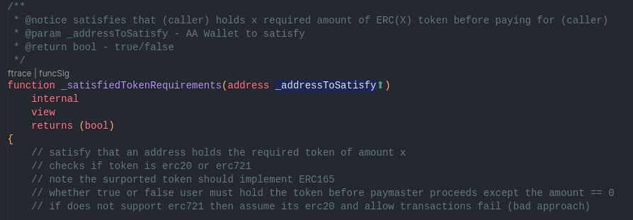
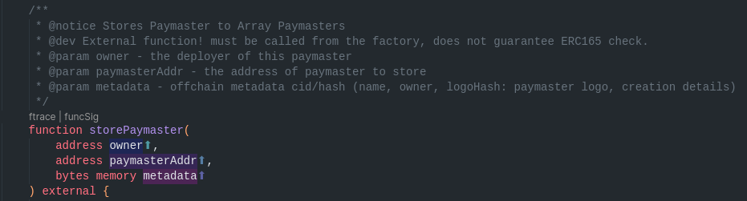
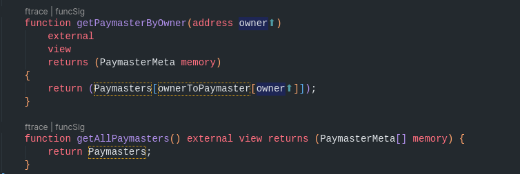

# Institutional Paymaster

## Summary

Institutional paymaster is a possile new approach to handling paymasters for wallets implementing Account Abstraction. It provides a single interface from which protocols, organizations etc can provide gas offsetting capabilities for their end users and specify terms of use. Since it's a single point of entry, users have the opportunity to choose any paymaster they are eligible to use without handling complex interactions.
It similarly allows organizations to specify qualifications that must be met before they can pay fees without creating complex logic.

## Paymaster

the master logic is straighforward and follows [IPaymaster](https://github.com/matter-labs/v2-testnet-contracts/blob/main/l2/system-contracts/interfaces/IPaymaster.sol), however there are few introductions in ISPaymaster.

- satisfy
    
satisy is meant make sure tht a paymaster is satisfied with a user before agreeing to offset the gas fees. according to the cust validation checks set during ployment. the paymaster makes sure that a user meets all criterion before be allowed to use ethereum for free.
- store
    
a storage contract that is meant to hold the address and offchain metadata of all paymasters. basically creating an easy way to access any paymaster
 the getter functions also define a way to access any paymaster from a front end.
    

## Paymaster Factory

A contract that deploys paymasters with custom configurations.
Contracts deployed by the PaymasterFactory is [ISPaymaster](./contracts/interface/IPaymaster.sol) but follows the [IPaymaster](https://github.com/matter-labs/v2-testnet-contracts/blob/main/l2/system-contracts/interfaces/IPaymaster.sol) interface and supports [IERC165](https://github.com/OpenZeppelin/openzeppelin-contracts/blob/master/contracts/utils/introspection/IERC165.sol) also.
Paymasters take configurations as follows:

- Max Nonce:
This allows paymasters to restrict the use of their paymasters to wallets with account nonce < maxNonce. Basically targeting newly created wallets in other to capture users who are new to crypto.
- UseCustomToken :
This allows paymasters to charge gas fees in ERC20 or use ERC20 or ERC721 tokens to gate interaction with the paymasters.
- Amount:
This is the amount of X token a user is required to hold before allowed to access a paymaster
- TokenAdress: this can either be ERC20 or ERC721. It allows organizations to provide free gas to users holding a specific ERC721 token or a specific amount of ERC20 token, better still charge users in such token.
- Validation Address (VA): May be linked to governance addresses or protocol addresses. The validation address VA takes a lot of high level privileges including receiving ERC20 fees.
At deployment, some of the configurations are stored on IPFS and used in the SyncWallet UI only.

# Sync Wallet

The sync wallet is a front-end demo on how a single point for accessing paymasters (but not failure) can impact user experience and help drive user onboarding.
Visit [Sync Wallet](https://instpaymaster.vercel.app) To see a working browser based wallet built to support AA and an interface for accessing multiple paymasters.
nb: Ethereum jsonRPC injected by coinbase wallet is not used as a provider for now.

### How it works

A user can easily create an AA account and start using a paymaster from the list of available paymasters.

1. EOA is not supported but however, a private key is used as an EIP712 signer
2. After account is deployed, account is saved to an  encrypted browser storage whhich use a combination of sha256 and AES to encrypt private key. (though may be strongly discourage (but for demo))
    
3. A user can perform simple operations like token transfers and can also deploy a paymaster.
    
4. Must provide the necessary constructor arguments in order to deploy a paymaster. Depending on the use case.
    
5. After a paymaster is deployed, a list of paymasters are pulled from a contract storage, where they can select a paymaster to use and by default all transactions would be processed with the paymaster while the account is still eligible.
    

The EIP712signing private key is stored on an Encrypted browser storage. Currently a salt is used to decrypt but in the future, Ethereum signatures from a Guardian account or Social security method can be used to decrypt it.

Benefits:

- Having a paymaster interface can help expand the kind of Daos that exists.
- There can be specialized Daos that are primarily focused on gas offsets
- Custom paymaster arguments gives organisations control of their end target.
As well as being able to provide smooth service to your community.
- If you interact with Ethereum for free by holding a token, then it's safe to say that there will be less hard hitting bear markets as you can be incentivised to hold.
- Wallet integration is easy
- Might become a prime focus for attackers,
- My Implemenatation Relies on Private key for EIP712 signing.
- My implementation Uses ECDSA which is (may) not be the best approach

Improvements:
Move to a secured key storage instead of browser storage.
Allows larger paymaster use case such as
One time use paymasters: runs only for a duration.
Cross chain transactions: interact in other chains and settle fees with the chain with which you have enough funds.
Paymaster extension: allow other paymasters to extend gas offset to sister or brother paymaster while the current paymaster refills Eth.

Not implemented:
 Signing transactions with active paymaster.

### Setup

1. Contracts

```bash
git clone https://github.com/peteruche21/inst-paymaster.git
# set up your .env variable
# rename .env.example to .env and provide the required keys
yarn install
yarn hardhat compile
yarn hardhat deploy-zksync

```

if you get any error   `cannot not use import outside ....` change module to `module: CommonJs` in ts-config

2. Front-end

```bash
# assuming you have already cloned this repo
yarn install
yarn start

# for prod
yarn build
```
